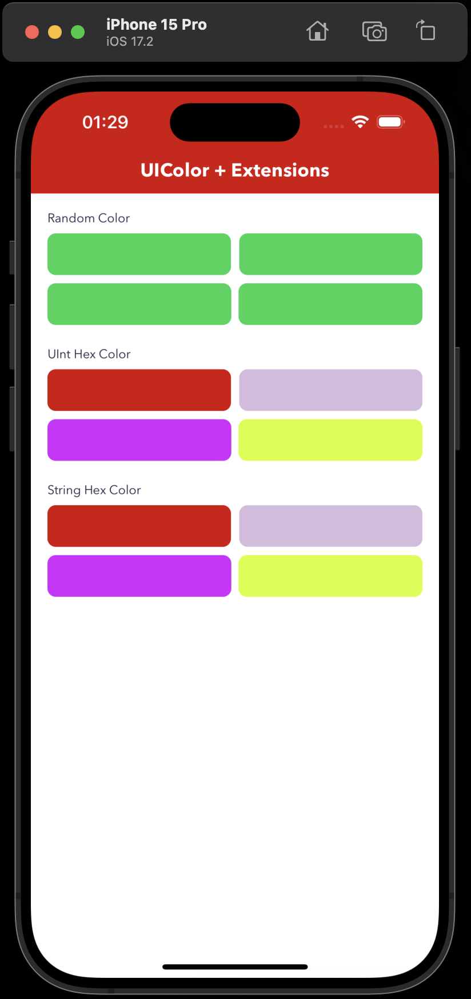

# Extensions

Swift Extensions are a powerful tool that lets you add new functionality to existing building blocks of your code, like classes, structures, enumerations, and even protocols.

## UIColor Extension Features

- Random Color
- Hex Color
- String Hex Color
- Color to Hex String

## Usage
- Random Color
`customView.backgroundColor = UIColor.randomColor`
- Hex Color
`customView.backgroundColor = UIColor(hex: 0xd50000)`
- String Hex Color
`customView.backgroundColor = UIColor(hex: "#d50000")`
- Color to Hex String
`let hexColor = fiveView.backgroundColor?.toHex()`

## Screen

<strong>Screen</strong>

  

## Maintainer ✨

**Extensions** is built with 🧡 by [Arvind Yadav](https://github.com/knowbiea).

Your support and feedback are valuable for maintaining and improving the extension.

---
