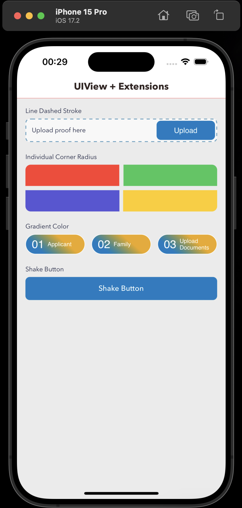

# Extensions

Swift Extensions are a powerful tool that lets you add new functionality to existing building blocks of your code, like classes, structures, enumerations, and even protocols.

## View Extension Features

- Corner Radius (IBDesignable)
- Border (IBDesignable)
- Shadow (IBDesignable)
- Load Nib
- Individual Round Corner Radius
- Shake View
- Line Dashed Stroke
- Gradient

## Usage
- Load Nib
`let customView: CustomView = .loadFromNib()`

- Individual Round Corner Radius
`customView.roundCorner(.topLeft, 10)`

- Shake View
`customView.shakeHeavy()`

- Line Dashed Stroke
`customView.addLineDashedStroke(pattern: [6, 6], radius: 8, color: UIColor(hex: 0x5D9DBE).cgColor)`

- Gradient
`customView.setGradientBackground()`
Information: Sometime you need to configure the startPoint and endPoint

## Screen

<strong>Screen</strong>

  

## Maintainer ✨

**Extensions** is built with 🧡 by [Arvind Yadav](https://github.com/knowbiea).

Your support and feedback are valuable for maintaining and improving the extension.

---
